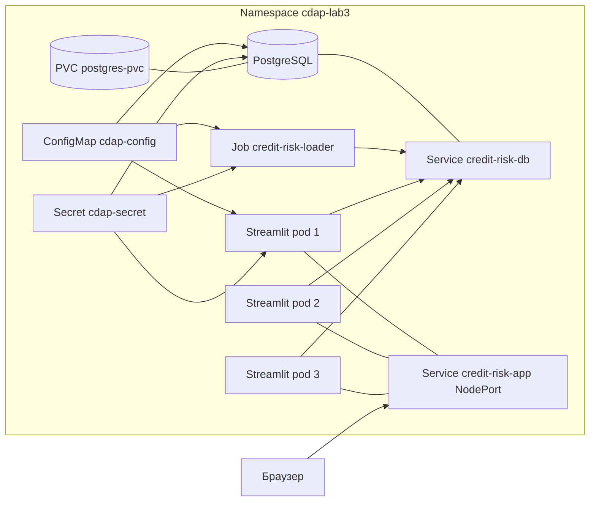

# Лабораторная работа №3. Kubernetes (Minikube): миграция с Docker Compose

**Выполнил:** Алексей Алехов Александрович  
**Группа:** БД-251м  
**Вариант:** 10 (финансы / Credit Default Analytics)

**Техническое задание (K8s):** база данных с **replicas: 1**, приложение (Streamlit) с **replicas: 3** для демонстрации балансировки нагрузки через объект **Service**.

Ориентир по структуре задания: [методические материалы ЛР3](https://github.com/BosenkoTM/CI_CD_25/blob/main/practice/2026/lw_03/lw_03_simple.md).

---

## 1. Цель работы

Освоение оркестрации контейнеризированных приложений в **Kubernetes**: перенос конфигурации из Docker Compose в манифесты **Secret**, **ConfigMap**, **PersistentVolumeClaim**, **Deployment**, **Service**, **Job**; настройка **InitContainer**, **Liveness/Readiness** probes и персистентного хранения данных для PostgreSQL.

---

## 2. Архитектура (миграция из ЛР2)

| Слой Compose | Объект Kubernetes |
|---------------|---------------------|
| Сервис `db` + volume | `Deployment` (1 реплика) + `PVC` + `Service` ClusterIP |
| Сервис `analytics_app` (порт 8501) | `Deployment` (3 реплики) + `Service` NodePort |
| Сервис `loader` | `Job` (однократная загрузка CSV в БД) |
| Файл `.env` | `Secret` + `ConfigMap` |



Образ приложения и скрипт ETL совпадают с **ЛР2**: используется единый `Dockerfile` из каталога `Lab2/`. Для Kubernetes был собран образ `cdap-analytics:lab3`.

---

## 3. Структура каталога

```
Lab3/
├── README.md              # данный отчет
├── docs/                  # скриншоты для отчета
├── artifacts/             # текстовые артефакты kubectl
└── k8s/
    ├── namespace.yaml
    ├── secret.yaml
    ├── configmap.yaml
    ├── pvc.yaml
    ├── db-deployment.yaml
    ├── db-service.yaml
    ├── loader-job.yaml
    ├── app-deployment.yaml
    ├── app-service.yaml
    └── kustomization.yaml
```

Переменные окружения в подах **не захардкожены**: значения задаются через `configMapRef` и `secretRef`. Секреты в `secret.yaml` представлены в **base64**.

---

## 4. Порядок выполнения

### 4.1. Запуск Minikube

```bash
minikube start --profile lab3-docker --driver=docker
```

### 4.2. Сборка образа ЛР2 и загрузка в Minikube

Чтобы Kubernetes не тянул образ из внешнего registry, приложение собирается локально и загружается в Minikube:

**Windows PowerShell:**

```powershell
cd Lab2
docker build -t cdap-analytics:lab3 .
minikube -p lab3-docker image load cdap-analytics:lab3
```

### 4.3. Подготовка данных для Job

Файл `course_project_test.csv` был добавлен в каталог `Lab2/data/` и включен в Docker-образ приложения. Поэтому `loader Job` считывает данные напрямую из контейнера по пути `/app/data/course_project_test.csv`.

Отдельный `ConfigMap` для CSV не использовался, так как реальный размер файла создавал лишние ограничения и практичнее было положить датасет в образ загрузчика.

### 4.4. Развёртывание манифестов

Рекомендуемая последовательность применения:

```bash
cd Lab3
kubectl apply -k .\k8s
kubectl get all -n cdap-lab3
```

Фактически были созданы следующие объекты:

- `namespace/cdap-lab3`
- `configmap/cdap-config`
- `secret/cdap-secret`
- `persistentvolumeclaim/postgres-pvc`
- `deployment/credit-risk-db`
- `service/credit-risk-db`
- `job/credit-risk-loader`
- `deployment/credit-risk-app`
- `service/credit-risk-app`

### 4.5. Проверки

```bash
kubectl get all -n cdap-lab3
kubectl get pvc -n cdap-lab3
kubectl describe deployment credit-risk-app -n cdap-lab3
kubectl get pods -n cdap-lab3 -o wide
kubectl logs job/credit-risk-loader -n cdap-lab3
```

Ожидаемый результат, который был получен в ходе проверки:

- Job `credit-risk-loader` — **Complete**
- Pod приложения — **3** экземпляра в статусе **Running**
- Pod БД — **1** экземпляр в статусе **Running**
- PVC `postgres-pvc` — **Bound**

**Доступ к Streamlit из браузера:**

В данном окружении доступ был подтвержден через `kubectl port-forward`:

```bash
kubectl port-forward -n cdap-lab3 svc/credit-risk-app 8501:8501
```

После этого приложение открывалось по адресу `http://127.0.0.1:8501`, а проверка встроенного health endpoint `/_stcore/health` возвращала `ok`.

**Вариант 10 (балансировка):** у `credit-risk-app` три конечных pod'а; приложение также получает имя текущего pod через переменную `POD_NAME`, что позволяет продемонстрировать работу нескольких реплик.

---

## 5. Персистентность данных (для отчёта)

1. После завершения `credit-risk-loader` в таблице `analytics_raw` находилось `2500` строк.
2. Pod базы данных был удален командой:
   `kubectl delete pod -n cdap-lab3 -l app=credit-risk-db`
3. После пересоздания pod количество строк в `analytics_raw` снова составило `2500`.

Это подтверждает, что данные сохраняются за счёт **PersistentVolumeClaim** `postgres-pvc`.

---

## 6. Пробы (Probes)

- **InitContainer** на базе `busybox:1.36` ожидает доступность сервиса `credit-risk-db:5432` до старта приложения и `loader Job`.
- **LivenessProbe** и **ReadinessProbe** используют HTTP GET к `/_stcore/health` на порту **8501**.
- В приложении предусмотрена дополнительная логика, чтобы интерфейс не падал, если БД уже доступна, но ETL-таблицы еще не созданы.

---

## 7. Очистка

Для удаления всех объектов лабораторной работы достаточно удалить пространство имен:

```bash
kubectl delete namespace cdap-lab3
```

При необходимости можно удалить и профиль Minikube:

```bash
minikube delete -p lab3-docker
```

---

## 8. Чек-лист соответствия критериям

| Критерий | Реализация |
|----------|------------|
| Deployment БД + Service ClusterIP | `db-deployment.yaml`, `db-service.yaml` |
| Deployment приложения + NodePort | `app-deployment.yaml` (3 реплики), `app-service.yaml` |
| ConfigMap / Secret без хардкода в контейнере | `configmap.yaml`, `secret.yaml`, `envFrom` в манифестах |
| PVC 1Gi RWO | `pvc.yaml`, монтирование в `db-deployment.yaml` |
| InitContainer + Probes | `app-deployment.yaml`, `loader-job.yaml` |
| Вариант 10 | `replicas: 3` в `app-deployment.yaml` |
| Job загрузки данных | `loader-job.yaml` |

---

## 9. Листинги манифестов

Исходные YAML-файлы расположены в каталоге `Lab3/k8s/`.

В отчете использованы следующие подтверждающие материалы:

- `kubectl get all -n cdap-lab3`
- `kubectl get pvc -n cdap-lab3`
- `kubectl describe deployment credit-risk-app -n cdap-lab3`
- `kubectl logs job/credit-risk-loader -n cdap-lab3`
- проверка HTTP-доступа к приложению через `kubectl port-forward`
- подтверждение персистентности после удаления pod БД
