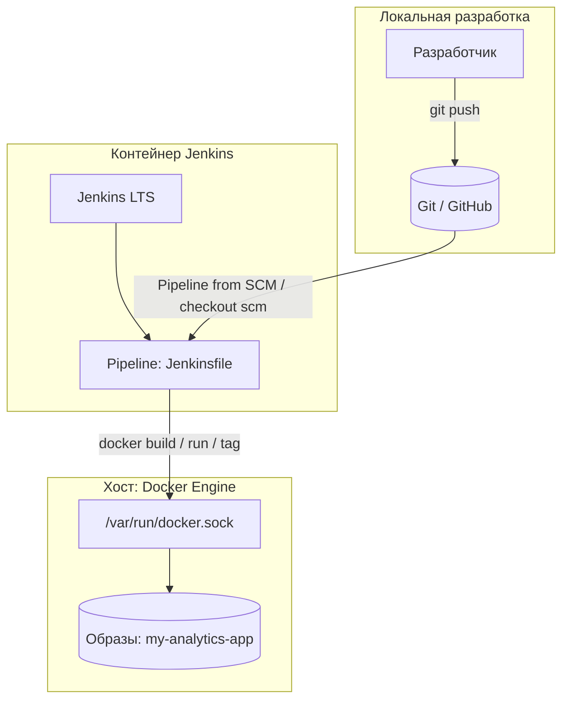

# Лабораторная работа №4  
## Автоматизация ETL-компонента с помощью CI/CD

| Поле | Значение |
|------|----------|
| **Студент** | Войт Иван Иванович |
| **Группа** | БД-251м |
| **Вариант задания** | 10 (Финансы / Default Pred) |

Структура текстовой части отчёта согласована с методическим примером ([lw_04_ans_v20.md](https://github.com/BosenkoTM/CI_CD_25/blob/main/practice/2026/lw_04/lw_04_ans_v20.md)): архитектура, технический стек, разбор конфигурации и сценария Quality Gate — **адаптировано** под **вариант А (Jenkins в Docker)** и **вариант 10 (уведомления о статусе)**.

---

## 1. Цель работы

Настроить автоматический конвейер (Pipeline) непрерывной интеграции и доставки (CI/CD) для ETL-компонента и аналитического приложения из предыдущих работ (ЛР2). Обеспечить проверку качества кода (linting), автоматическую сборку Docker-образа при изменениях в репозитории и симуляцию доставки (CD). Реализовать **уведомления о статусе сборки** (вариант 10) — в качестве заглушки используется вывод в консоль (`echo`), что допускается методичкой.

---

## 2. Выбор инструментария

Реализован **вариант А — локальный контур**: Jenkins в Docker на рабочей машине. Преимущества: полный контроль, независимость от внешних ограничений, соответствие корпоративной практике.

Каталог с конфигурацией CI-сервера: **`jenkins_cicd/`** в корне репозитория.

---

## 3. Архитектура решения

В отличие от облачных сценариев (GitHub Actions / GitLab CI), здесь CI выполняется **внутри контейнера Jenkins**, а сборка и запуск образов приложения идут через **Docker Engine хоста** (проброс сокета `docker.sock`). Так достигается промышленно распространённая схема «Jenkins + Docker на одной машине» без отдельного registry на этапе лабораторной работы.



**Поток данных по стадиям пайплайна:** после **Checkout** код лежит в workspace агента. **Linting** выполняется в каталоге `Lab2` во вложенном venv (изоляция от системного Python и обход ограничений PEP 668 в образе Jenkins). **Build Image** вызывает `docker build` на хосте и помечает образ тегом `${BUILD_NUMBER}`. **Test Run** поднимает контейнер из собранного образа и выполняет `python version_check.py --version`. **Deploy** дублирует тег на `latest`. Блок **`post`** срабатывает после завершения всех стадий и формирует «уведомление» об успехе или провале.

---

## 4. Технический стек

| Компонент | Назначение |
|-----------|------------|
| **ОС хоста** | Windows 10 (Docker Desktop); Jenkins — Linux-контейнер. |
| **Контейнеризация** | Docker, образ приложения на базе `python:3.10-slim` (см. `Lab2/Dockerfile`). |
| **CI** | Jenkins LTS (`jenkins/jenkins:lts`), кастомный слой: Docker CLI в образе, entrypoint для прав на `docker.sock`. |
| **Качество кода** | Python 3, виртуальное окружение в workspace, **pylint** с `.pylintrc`, порог **`--fail-under=5.0`**. |
| **Артефакт** | Docker-образ **`my-analytics-app:<BUILD_NUMBER>`**, тег **`latest`** после успешного Deploy. |
| **Вариант 10** | Декларативный блок **`post { success / failure }`** + `echo` / `sh` как заглушка под мессенджер или почту. |

---

## 5. Разбор конфигурации и кода

Ниже — пояснение к файлам репозитория, на которых строится автоматизация (аналог детального «технического разбора» в примере lw_04).

### 5.1. Каталог `jenkins_cicd/`: запуск Jenkins

**`docker-compose.yml`** поднимает сервис Jenkins на портах **8080** и **50000**, монтирует том **`jenkins_home`** и **`/var/run/docker.sock`**. Сборка идёт из локального **`Dockerfile`**, образ помечается как `jenkins-cdap-lab4:local`. Проброс сокета нужен, чтобы команды `docker` внутри Jenkins обращались к **тому же демону**, что и на хосте (образы появляются в `docker images` на машине студента).

**`Dockerfile` (надстройка над `jenkins/jenkins:lts`):** под пользователем `root` ставится пакет **`docker.io`** (CLI). Это надёжнее, чем монтировать `/usr/bin/docker` с хоста Windows — такой путь часто несовместим с бинарником внутри Linux-контейнера. Скопирован **`jenkins-entrypoint.sh`**: перед стартом Jenkins выставляются права на **`docker.sock`** (`chmod 666`), затем запускается стандартный **`jenkins.sh`** через **`tini`**. В Dockerfile для скрипта выполняется **`sed`** удаления символов `\r` (CRLF при редактировании на Windows), иначе контейнер падает при старте.

### 5.2. Корневой `Jenkinsfile` (declarative pipeline)

| Фрагмент | Что делает код |
|----------|----------------|
| `pipeline { agent any }` | Пайплайн выполняется на доступном агенте (встроенный узел Jenkins в контейнере). |
| `environment { IMAGE_NAME = 'my-analytics-app' }` | Единое имя образа для всех стадий; теги — номер сборки Jenkins и `latest`. |
| **`stage('Checkout')`** | `checkout scm` — получение ревизии из настроенного в Job Git (ветка `main` и т.д.). |
| **`stage('Linting')`** | `dir('Lab2')` переключает шаги в каталог лабораторной работы 2. Блок `sh '''...'''`: при отсутствии `python3` ставятся пакеты через `apt-get`; создаётся **`.jenkins-venv`**, в него ставится **pylint**, затем запуск **`pylint --fail-under=5.0 --rcfile=.pylintrc`** для `src/etl_loader.py`, `app/main.py`, `version_check.py`. Если оценка ниже порога или есть ошибки — стадия падает (**Quality Gate по стилю и явным ошибкам**). |
| **`stage('Build Image')`** | Длинный bash-скрипт: убедиться, что доступен **`docker` CLI** (системный, из `docker.io`, либо скачанный статический бинарник в **`${WORKSPACE}/.jenkins-docker-cli`** — запасной путь, если образ Jenkins минимальный). Для сокета **`chmod 666`** на время шага. **`docker build -t my-analytics-app:${BUILD_NUMBER} .`** в контексте **`Lab2/`** — сборка образа из материалов ЛР2. |
| **`stage('Test Run')`** | `docker run --rm ... python version_check.py --version` — смоук-тест: контейнер стартует и возвращает версию; при ненулевом коде выхода стадия красная. |
| **`stage('Deploy')`** | **`docker tag`** образа с номером сборки на **`my-analytics-app:latest`** — локальная симуляция выката «последней успешной» версии. |
| **`post { success { ... } failure { ... } }`** | Выполняется **после** завершения всех стадий. В **`success`** и **`failure`** дублируется логика «уведомления»: **`echo`** в лог Jenkins и **`sh "echo ..."`** с текстом **`[NOTIFY] Build Success`** / **`Build Fail`** и подписью **`(заглушка под Telegram/e-mail)`** — это и есть реализация **варианта 10** без внешних API. |

Итог: **провал lint или теста** останавливает пайплайн на соответствующей стадии; блок **`failure`** в **`post`** всё равно выполнится и покажет **Build Fail** в логе (как требуется для демонстрации уведомлений).

### 5.3. `Lab2/Dockerfile` (контекст сборки CI)

Образ приложения копирует **`requirements.txt`**, устанавливает зависимости, копирует **`app/`**, **`src/`**, **`data/`**, **`version_check.py`**, пользователь **`appuser`**, точка входа по умолчанию — Streamlit. Именно этот Dockerfile собирает стадия **Build Image**; CI дополнительно проверяет работоспособность через **`version_check.py`**.

---

## 6. Ход работы

### 6.1. Этап 1. Запуск локального CI-сервера

- Использован **`docker-compose.yml`** в каталоге `jenkins_cicd/` (кастомный образ Jenkins с Docker CLI внутри контейнера и проброс сокета хоста — удобно для Windows).
- Сервис: Jenkins на портах **8080** и **50000**, том **`jenkins_home`**, монтирование **`/var/run/docker.sock`** для сборки образов на движке Docker хоста.
- Сборка и запуск (из каталога `jenkins_cicd`):

```bash
docker compose build
docker compose up -d
```

- Первичная настройка: браузер **http://localhost:8080**, пароль администратора из логов контейнера, установка рекомендуемых плагинов, создание пользователя.

**Доказательство (отчётность):** скриншот интерфейса Jenkins с созданной задачей Pipeline (см. раздел 10 и **`SCREENSHOTS.md`**).

---

### 6.2. Этап 2. Подготовка репозитория — Jenkinsfile

В **корне репозитория** размещён файл **`Jenkinsfile`** (declarative pipeline). Минимум трёх стадий выполнен с запасом: описаны **Checkout**, **Linting**, **Build Image**, **Test Run**, **Deploy**.

Кратко по стадиям:

| Стадия | Назначение |
|--------|------------|
| **Checkout** | Получение кода из SCM (`checkout scm`). |
| **Linting** | В каталоге `Lab2`: виртуальное окружение, установка **pylint**, проверка с порогом **`--fail-under=5.0`** и конфигом **`.pylintrc`** для файлов `src/etl_loader.py`, `app/main.py`, `version_check.py`. |
| **Build Image** | Сборка образа **`my-analytics-app:${BUILD_NUMBER}`** из **`Lab2/`** (`docker build` в контексте лабораторной работы 2). |
| **Test Run** | Запуск контейнера и проверка версии: `python version_check.py --version`. |
| **Deploy** | Локальная «доставка»: тег **`my-analytics-app:latest`** указывает на успешно собранный образ текущей сборки (`docker tag`). |

Дополнительно в пайплайне учтены особенности окружения (установка `python3`/venv при необходимости, доступ к Docker CLI и сокету) — чтобы сборка стабильно проходила в контейнере Jenkins.

---

### 6.3. Этап 3. Настройка Job в Jenkins

1. **New Item** → тип **Pipeline** → имя задачи (например, `DevOps-Lab4`).
2. В разделе **Pipeline** → **Definition**: **Pipeline script from SCM**.
3. **SCM**: Git, URL репозитория: `https://github.com/youngvoyt/DevOps-.git` (или SSH — по выбору).
4. Ветка: **`main`** (или та, в которой лежит `Jenkinsfile`).
5. **Script Path**: `Jenkinsfile`.
6. Сохранение → **Build Now** — контроль зелёной сборки и логов **Console Output**.

---

### 6.4. Этап 4. Симуляция CD

Стадия **Deploy** обновляет локальный «релизный» тег Docker-образа **`my-analytics-app:latest`**, не требуя внешнего registry. При необходимости образ можно вручную отправить в Docker Hub отдельной командой (в рамках ЛР достаточно локальной демонстрации).

---

### 6.5. Вариант 10 — уведомления о статусе (Quality Gate по методичке)

Техническое требование: сообщение **Build Success / Build Fail** (Telegram, почта или **заглушка**).

Реализовано в блоке **`post { success { ... } failure { ... } }`** в **`Jenkinsfile`**: вывод строк **`[NOTIFY] Build Success`** и **`[NOTIFY] Build Fail`** через **`echo`** и повтор через `sh "echo ..."` — имитация отправки уведомления без внешних сервисов, как разрешено заданием.

---

## 7. Технический отчёт по сценарию Quality Gate (вариант 10 + Lint)

| Параметр | Поведение в данном проекте |
| :--- | :--- |
| **Порог качества кода** | `pylint --fail-under=5.0`; при падении стадия **Linting** красная, до сборки образа пайплайн не доходит. |
| **Проверка артефакта** | **Test Run**: ненулевой код выхода `version_check.py` → красная сборка. |
| **Уведомление при успехе** | Блок **`post` → `success`**: строки с **`[NOTIFY] Build Success`** в логе консоли Jenkins. |
| **Уведомление при провале** | Блок **`post` → `failure`**: строки с **`[NOTIFY] Build Fail`** (срабатывает при падении любой стадии, включая Lint). |
| **Отличие от `always()` в GitHub Actions** | В Declarative Pipeline Jenkins **`post`** с **`failure`/`success`** — стандартный способ отреагировать на итог; отдельный шаг «очистки» как в примере с Docker не требуется заданием, но при необходимости его можно добавить в `post { always { ... } }`. |

---

## 8. Демонстрация Quality Gate (провал и успех)

Требуется **два запуска**: неуспешный (код «плохой») и успешный (после исправления).

**Рекомендуемый сценарий:**

1. Внести в код синтаксическую ошибку (например, в `Lab2/src/etl_loader.py` добавить недопустимую строку), закоммитить и отправить в GitHub, запустить **Build Now** — сборка **красная**, в логе — **`[NOTIFY] Build Fail`**.
2. Убрать ошибку, закоммитить, снова **Build Now** — сборка **зелёная**, в логе — **`[NOTIFY] Build Success`**.

Подробные пошаговые действия и имена файлов скриншотов приведены в **`SCREENSHOTS.md`** в этой же папке.

---

## 9. Сборка Docker-образа и проверка на хосте

После успешной сборки в Jenkins на машине с Docker выполнить:

```powershell
docker images
```

В списке должны присутствовать образы вида **`my-analytics-app`** с тегами номера сборки и **`latest`** — это подтверждает критерий «образ виден в `docker images`».

---

## 10. Отчётность 

### 10.1. Ссылка на репозиторий

- **GitHub:** https://github.com/youngvoyt/DevOps-  
- В репозитории: **`Jenkinsfile`**, каталог **`Lab2/`** (Dockerfile, код, тесты, `.pylintrc`), **`jenkins_cicd/`** (запуск Jenkins).

### 10.2 Список скриншотов
| № | Имя файла | Что должно быть видно |
|---|-----------|------------------------|
| 1 | `01_jenkins_job_dashboard.png` | Браузер: Jenkins, ваша Pipeline-задача, блок **Build History** (хотя бы одна сборка). |
| 2 | `02_github_jenkinsfile_overview.png` | GitHub: файл `Jenkinsfile` в корне репо, видны стадии и блок `post` (вариант 10). |
| 3 | `03_jenkins_console_red_build_fail.png` | **Console Output** красной сборки: фрагмент ошибки (lint/другое) + в конце **`[NOTIFY] Build Fail`**. |
| 4 | `04_jenkins_console_green_build_success.png` | **Console Output** зелёной сборки: **SUCCESS** + **`[NOTIFY] Build Success`**. |
| 5 | `05_docker_images_my-analytics-app.png` | PowerShell / терминал: команда `docker images`, строки с **`my-analytics-app`**. |
| 6 | *(опционально)* `06_jenkins_stage_view_green.png` | Страница задачи со **Stage View** (цветные стадии) для успешной сборки. |


## 12. Структура каталога `lab4`

| Файл | Назначение |
|------|------------|
| `README.md` | Текстовый отчёт по ЛР4 (этот документ). |
| `01_jenkins_job_dashboard.png` | Описание скриншотов и сценария для отчёта/видео. |
| `02_github_jenkinsfile_overview.png` | Описание скриншотов и сценария для отчёта/видео. |
| `03_jenkins_console_red_build_fail.png` | Описание скриншотов и сценария для отчёта/видео. |
| `04_jenkins_console_green_build_success.png` | Описание скриншотов и сценария для отчёта/видео. |
| `05_docker_images_my-analytics-app.png`| Описание скриншотов и сценария для отчёта/видео. |

---

*Дата подготовки отчёта: 22 марта 2026 г.*
